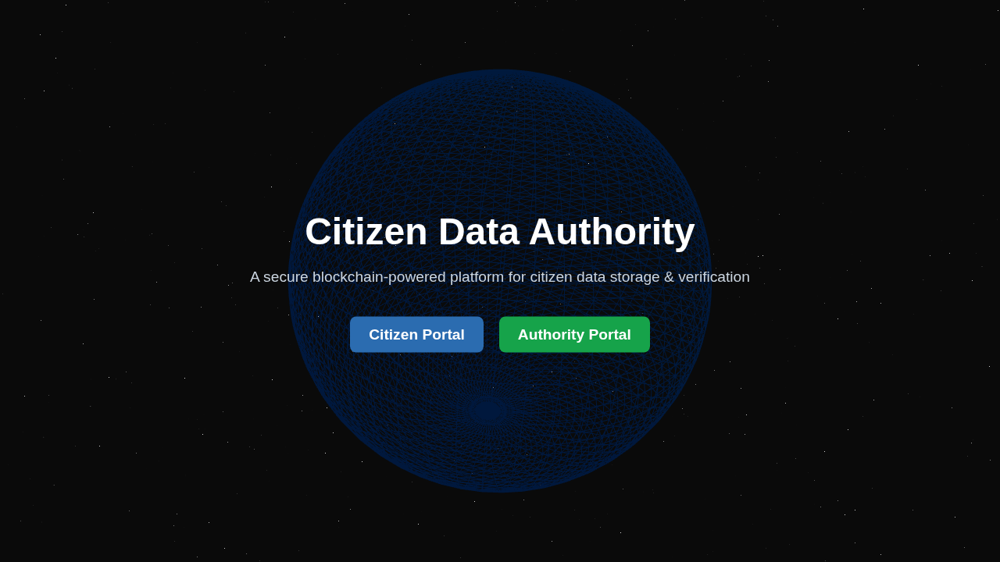
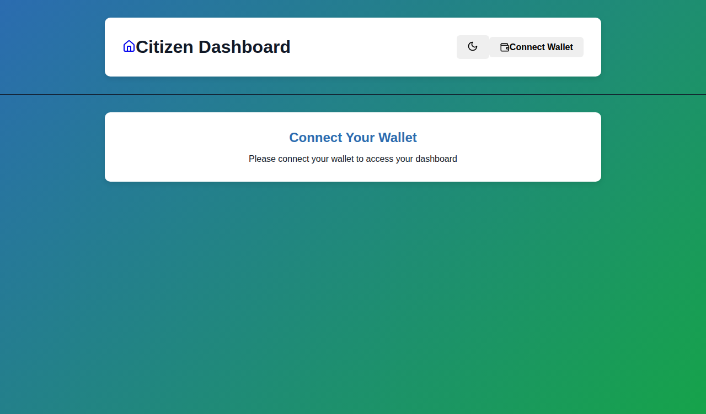
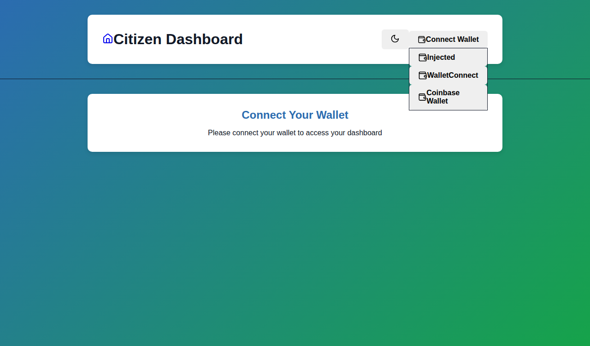
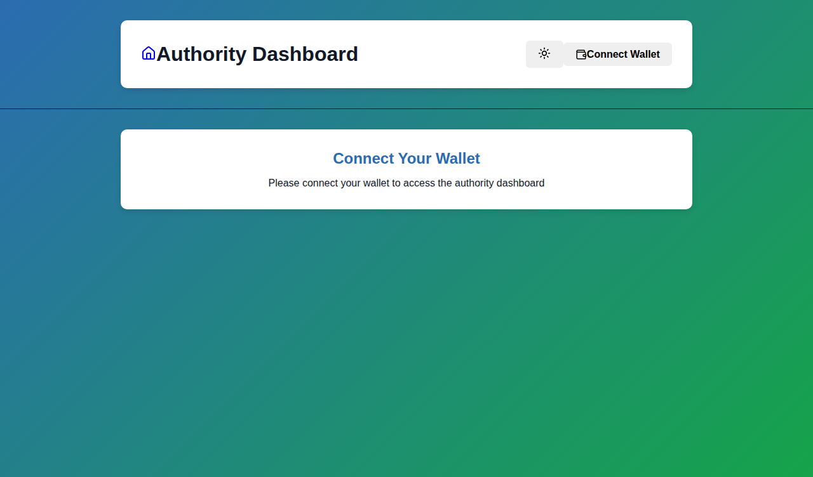

# UI Screenshots

This directory contains screenshots of the modernized Citizen Data Management UI with Wagmi v2 integration.

## Screenshots

### 1. Landing Page

The 3D animated landing page with options for Citizen and Authority portals.

### 2. Citizen Dashboard - Connect Wallet

Modern dashboard with wallet connection prompt, showing the clean header with theme toggle and wallet connect button.

### 3. Wallet Connect Dropdown

Wallet connection options including MetaMask (Injected), WalletConnect, and Coinbase Wallet.

### 4. Citizen Dashboard - Dark Mode

Dark mode support with smooth theme transitions and beautiful UI.

### 5. Authority Dashboard

Authority dashboard with search functionality for viewing citizen documents (with proper access control).

## Features Demonstrated

- ✅ Modern, responsive UI with Tailwind CSS
- ✅ Dark/Light theme toggle
- ✅ Wagmi v2 wallet integration
- ✅ Multiple wallet connector support
- ✅ Clean, professional design
- ✅ Proper loading states and error handling
- ✅ Mobile-first responsive design
